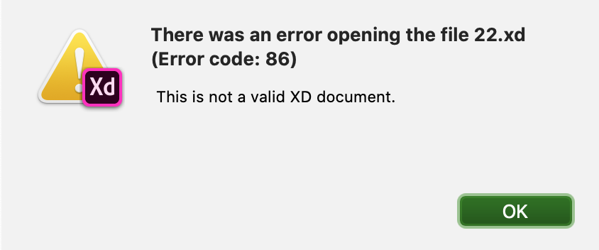
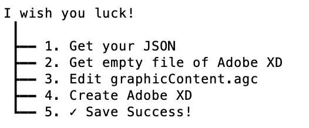
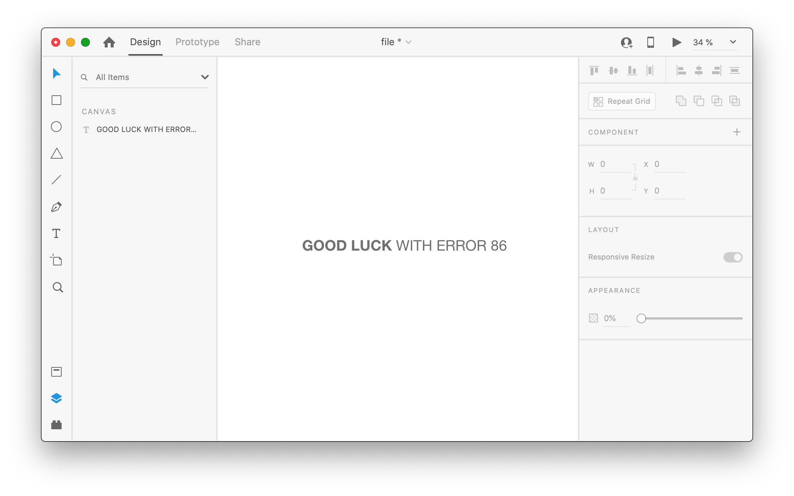
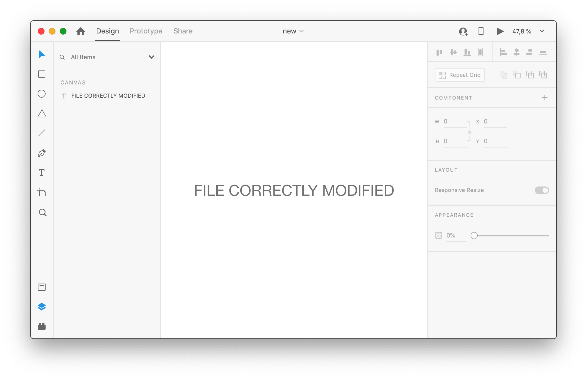

# Import JSON Art AGC to Adobe XD
This little script replaces the graphicContent.agc file on top of an Adobe XD project without generating the nasty **Error code: 86**.



For this we use exactly **JSZIP**. We've tried dozens of compression apps and for whatever reason they fail. I have not delved much into the reason.

### How to use:

- Add your JSON al archivo art.json
- Execute node index.js in terminal

### Where is the file located in the Adobe cloud?

Access the Adobe XD online viewer, open the Chrome developer tools, access Network and look for the request with the most weight (probably your JSON of graphicContent.agc).

```get
https://public-v2links.adobecc.com
```
### Screens



